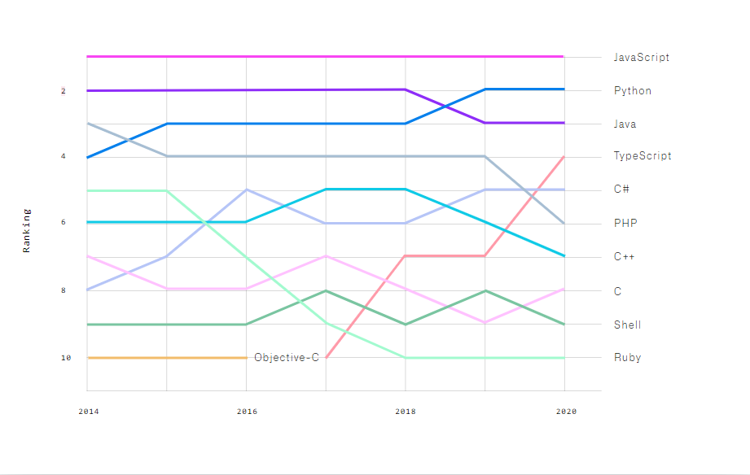
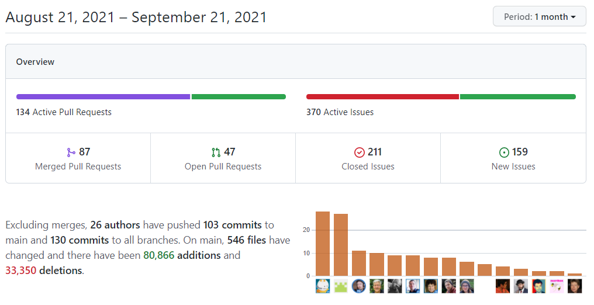

# TypeScript

## History and charactaristics

TypeScript is a strict superset of JavaScript which adds static typing. It is developed by Microsoft. After two years of development, it was released in October 2012.
The most known name to have worked on TS is Anders Hejlsberg who was the lead architect of C#. It transcompiles into JavaScript.

Due to the fact that TypeScript transpiles to JavaScript and JavaScript is used in several backend projects like NodeJs / lambdas in cloud providers, you can also use TypeScript for building backend systems nowadays.

TypeScript's type system can be defined as Duck; Gradual and Structural.

-   Duck: It sounds like a duck, walks like a duck; it's a duck
-   Gradual: Static typing but possibility to opt for the dynamic typing that javascript offers
-   Structural: In comparing two types, they are not compared using the name of the type (nominal) but based on the structure of the two.

Currently, TypeScript is in a three month release cycle where new features will be added.
It is open source.

In terms of popularity, according to GitHub TypeScript is gaining popularity really quickly and now in the 4th place.






## Why should you use it?
Consider the next bit of JavaScript:
```js
function calculateSalaryPlusBonus (salary, bonus) {
    return salary + bonus;
}
function calculateBonus(bonus) {
    // ...
    return `${bonus}`;
}

let salary = 30000;
let bonus = 0;

bonus = calculateBonus(bonus); // woops

console.log(`Total: ${calculateSalaryPlusBonus(salary, bonus)}`);
// Total: 300000
```

If we were to use typescript, we'd receive an error a long time ago.
```ts
function calculateSalaryPlusBonus (salary: number, bonus: number) {
    return salary + bonus;
}
function calculateBonus(bonus: number) {
    // ...
    return `${bonus}`;
}

let salary = 30000;
let bonus = 0;

bonus = calculateBonus(bonus); // type 'string' is not assignable to type 'number'

console.log(`total: ${calculateSalaryPlusBonus(salary, bonus)}`);
```

### Strict compiler checks
When you are using typescript, it is advisable to:
- Enable strict mode (in theory, the stricter the better)
- Never use `any` when defining a type. There are some exceptions:
  - In generic constraints (`function<T extends readonly any[]>`)
  - In spec files (use whatever is the most convenient)
  - If you know javascript very well, want to do something fancy and know what you are doing
  - If you do not (_yet_) know the type, use `unknown` instead of `any`. Typescript will force you to determine the type before you are allowed to do something.

Bugs that you will prevent:
```js
// Unavailable function and missing return statement
function contains(x) {
    x.includes('a');
}
contains(23); // Runtime error: Uncaught TypeError: x.contains is not a function

// Undefined / null issues
let x;
contains(x); // Runtime error: Uncaught TypeError: Cannot read properties of undefined

// Missing return statement
if(contains('a')) { // Will always be false; returns `undefined`
    // Unreachable code!
    console.log('a is found in the string!');
}
```

With TypeScript, all of these issues will simply not compile.
```ts
// Unavailable function
function contains(x: string) {
    x.includes('a');
}
contains(23); // Argument of type 'number' is not assignable to parameter of type 'string'

// Undefined / null issues
let x: string;
contains(x); // Variable 'x' is used before being assigned

let x: string | undefined;
contains(x); // Argument of type 'string | undefined' is not assignable to parameter of type 'string'.

if(contains('a')) { // An expression of type 'void' cannot be tested for truthiness
    console.log('a is found in the string!');
}
```

## Typescript compiler

The TypeScript compiler is itself built in TypeScript and consists of the following parts:


- **Parser**: Generates an Abstract Syntax Tree (AST)
- **Binder**: Linking declarations using a Symbol
- **Emitter**: Output generated from a set of inputs (.ts and .d.ts) files can be one of: JavaScript (.js), definitions (.d.ts), or source maps (.js.map)
- **Pre-processor**: Compilation context
- **Language Service**: Layer around the core compiler components that are suited for editor-like environments


## How to run

You can use the `tsc` compiler which is installed as soon as you run `npm i -g typescript`.
If you have typescript installed, you can run `tsc` in a folder with a typescript project, which will compile it into javascript.

You can also use the `babel` compiler.

To run some typescript code, you can either compile it and run it using `node-js` or go to either of the following websites:

-   To try out TypeScript vanilla: https://www.typescriptlang.org/play
-   To try out TypeScript with rxjs:
    -   https://stackblitz.com/fork/rxjs?devtoolsheight=60

## Initial local setup for a typescript project

-   Just compiling and running
    -   Create a `*.ts` file
    -   In the same folder, execute `tsc`
    -   The file (in fact, all `*.ts` files) will be compiled to `*.js`.
    -   Run the `*.js` file using `node <filename>.js`
-   TypeScript project with `dist` folder output
    -   Inside a clean folder, run `tsc --init` which will generate `tsconfig.json`
    -   Add `"outDir": "./dist",` to `tsconfig.json`
    -   Optionally, move your source files into `/src` and add `"rootDir": "./src"` to your `tsconfig.json`
    -   Also add `npm init` to generate a `package.json` file so we can run the code using `npm start` (add `"start": "node dist/<filename>.js"`)
    -   Optionally, you could add webpack into the equation to build everything into one bundle by installing `webpack` and `webpack-cli` globally, then adding `tsc && webpack ./dist/index.js -o dist` to your build script.
